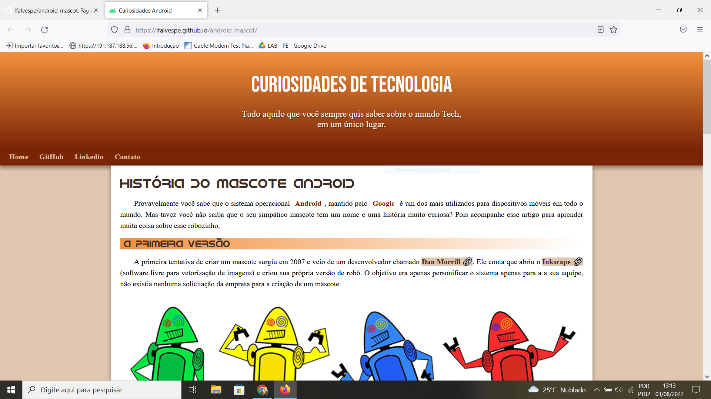

<h1>android-mascot</h1>

Página em HTML sobre a história do mascote do android. Criada como atividade do Curso de HTML5 e CSS3 do Curso em Vídeo.

Visualizar site: http://lfalvespe.github.io/android-mascot
  

